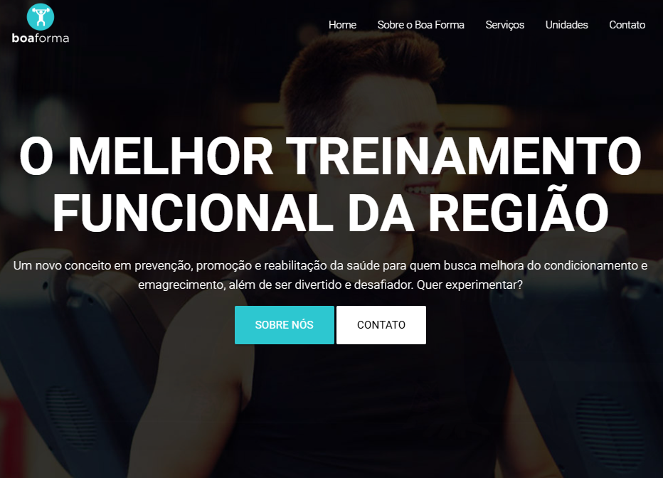

<h1 align="center">
  💻 Centro Boa Forma
</h1>

  

<h4 align="center"><a href="https://centro-boa-forma-nu.vercel.app/" target="_blank">Clique para visitar o projeto</a></h4>

## 📚 Sobre o projeto

Esse foi um projeto do curso de Carreira Web | Sites profissionais do canal Node Studio Treinamentos. Nele é desenvolvido um site completo e totalmente responsivo, que oferece diversos serviços, como musculação, pilates, fisioterapia, entre outros. O objetivo do site é promover os serviços do Centro Boa Forma, exibir imagens do estabelecimentos, endereços e contatos das unidades. 🚀

## 🛠️ Tecnologias utilizadas

• HTML 
• CSS 
• Jquery 
• Materialize CSS

## 🔗 Link do curso

https://www.youtube.com/watch?v=yMX8MuxMO3A&list=PLwXQLZ3FdTVGbnuBYtOnkIIwdYKYRuhYt
